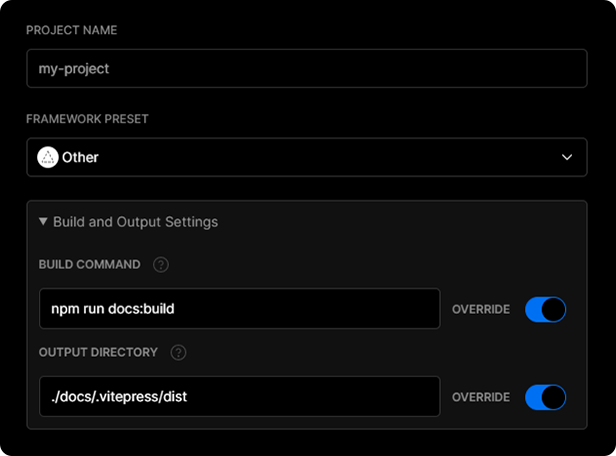

# 部署

以下指南基于一些共享的假设:

- 您将文档放在项目的`docs`目录下;
- 您正在使用默认的构建输出位置(`.vitepress/dist`);
- VitePress 作为本地依赖项安装在您的项目中, 并且您已经设置了以下 npm 脚本:

```json
{
  "scripts": {
    "docs:build": "vitepress build docs",
    "docs:serve": "vitepress serve docs"
  }
}
```

## 构建文档

你可以运行`yarn docs:build`命令来构建文档.

```bash
$ yarn docs:build
```

默认情况下, 构建输出将被放置在`.vitepress/dist`. 你可以将`dist`文件夹部署到任何你喜欢的平台上.

### 在本地测试文档

一旦你构建了这些文档, 你可以通过运行`yarn docs:serve`命令在本地测试.

```bash
$ yarn docs:build
$ yarn docs:serve
```

`serve`命令将启动本地静态 web 服务器, 该服务器在 http://localhost:5000 为`.vitepress/Dist`中的文件提供服务, 这是检查生产构建在您的本地环境中看起来是否正常的一种简单方法.

您可以通过传入`--port`标志作为参数配置服务器的端口.

```json
{
  "scripts": {
    "docs:serve": "vitepress serve docs --port 8080"
  }
}
```

现在, `docs: serve`方法将在 http://localhost:8080 启动服务器.

## GitHub Pages

1.  在 `docs/.vitepress/config.js` 中设置正确的 `base`.

    如果您部署到 `https://<USERNAME>.github.io/`, 你可以忽略 `base`, 因为它默认为'/'.

    如果您部署到 `https://<USERNAME>.github.io/<REPO>/`, 例如您的存储库是在 `https://github.com/<USERNAME>/<REPO>`, 然后设置 `base` 为 `'/<REPO>/'`.

2.  在你的项目中, 创建带有以下内容的 `deploy.sh` (带有突出显示的未适当注释的行), 并运行它来部署:

```bash{13,20,23}
#!/usr/bin/env sh

# abort on errors
set -e

# build
npm run docs:build

# navigate into the build output directory
cd docs/.vitepress/dist

# if you are deploying to a custom domain
# echo 'www.example.com' > CNAME

git init
git add -A
git commit -m 'deploy'

# if you are deploying to https://<USERNAME>.github.io
# git push -f git@github.com:<USERNAME>/<USERNAME>.github.io.git master

# if you are deploying to https://<USERNAME>.github.io/<REPO>
# git push -f git@github.com:<USERNAME>/<REPO>.git master:gh-pages

cd -
```

::: tip
您还可以在 CI 设置中运行上述脚本, 每次推送时启用自动部署.
:::

### GitHub Pages and Travis CI

1. 在 `docs/.vitepress/config.js` 中设置正确的 `base`.

   如果您部署到 `https://<USERNAME>.github.io/`, 你可以忽略 `base`, 因为它默认为'/'.

   如果您部署到 `https://<USERNAME>.github.io/<REPO>/`, 例如您的存储库是在 `https://github.com/<USERNAME>/<REPO>`, 然后设置 `base` 为 `'/<REPO>/'`.

2. 在项目根目录创建一个名叫 `.travis.yml` 的文件.

3. 在本地运行 `yarn` 或者 `npm install` 并提交生成的锁定文件(即 `yarn.lock` 或 `package-lock.json`).

4. 使用 GitHub Pages 部署模板, 并遵循[Travis CI 文档](https://docs.travis-ci.com/user/deployment/pages/).

```yaml
language: node_js
node_js:
  - lts/*
install:
  - yarn install # npm ci
script:
  - yarn docs:build # npm run docs:build
deploy:
  provider: pages
  skip_cleanup: true
  local_dir: docs/.vitepress/dist
  # A token generated on GitHub allowing Travis to push code on you repository.
  # Set in the Travis settings page of your repository, as a secure variable.
  github_token: $GITHUB_TOKEN
  keep_history: true
  on:
    branch: master
```

## GitLab Pages and GitLab CI

1. 在 `docs/.vitepress/config.js` 中设置正确的 `base`.

   如果您部署到 `https://<USERNAME>.github.io/`, 你可以忽略 `base`, 因为它默认为'/'.

   如果您部署到 `https://<USERNAME>.github.io/<REPO>/`, 例如您的存储库是在 `https://github.com/<USERNAME>/<REPO>`, 然后设置 `base` 为 `'/<REPO>/'`.

2. 将 `.vitepress/config.js` 中的 `dest` 设置为 `public`.

3. 在您的工程根目录下创建一个名为 `.gitlab-ci.yml` 的文件, 内容如下. 这将在您对内容进行更改时构建和部署您的站点:

```yaml
image: node:10.22.0
pages:
  cache:
    paths:
      - node_modules/
  script:
    - yarn install # npm install
    - yarn docs:build # npm run docs:build
  artifacts:
    paths:
      - public
  only:
    - master
```

## Netlify

1. 在 [Netlify](https://netlify.com), 从 GitHub 拉取新项目并进行如下设置:

- **Build Command:** `vitepress build docs` or `yarn docs:build` or `npm run docs:build`
- **Publish directory:** `docs/.vitepress/dist`

2. 点击部署按钮.

## Google Firebase

1. 确保你安装了 [firebase-tools](https://www.npmjs.com/package/firebase-tools).

2. 在您的工程根目录下创建 `firebase.json` 和 `.firebaserc`, 内容如下:

`firebase.json`:

```json
{
  "hosting": {
    "public": "./docs/.vitepress/dist",
    "ignore": []
  }
}
```

`.firebaserc`:

```js
{
 "projects": {
   "default": "<YOUR_FIREBASE_ID>"
 }
}
```

3. 运行 `yarn docs:build` 或 `npm run docs:build` 后, 使用 `firebase deploy` 命令进行部署.

## Surge

1. 如果尚未安装, 请首先安装 [surge](https://www.npmjs.com/package/surge).

2. 运行 `yarn docs:build` 或 `npm run docs:build`.

3. 通过键入 `surge docs/.vitepress/dist` 部署到 surge.

您也可以通过添加 `surge docs/.vitepress/dist yourdomain.com` 部署到[自定义文档](http://surge.sh/help/adding-a-custom-domain).

## Heroku

1. 安装 [Heroku CLI](https://devcenter.heroku.com/articles/heroku-cli).

2. 通过 [signing up](https://signup.heroku.com) 创建一个 Heroku 账号.

3. 运行`heroku login`并填写您的 heroku 凭据:

```bash
$ heroku login
```

4. 在您的工程根目录下创建一个名为 `static.json` 的文件, 内容如下:

`static.json`:

```json
{
  "root": "./docs/.vitepress/dist"
}
```

这是您站点的配置; 在 [heroku-buildpack-static](https://github.com/heroku/heroku-buildpack-static) 上阅读更多内容.

5. 设置你的 Heroku git 远程:

```bash
# version change
$ git init
$ git add .
$ git commit -m "My site ready for deployment."

# creates a new app with a specified name
$ heroku apps:create example

# set buildpack for static sites
$ heroku buildpacks:set https://github.com/heroku/heroku-buildpack-static.git
```

6. 部署您的站点:

```bash
# publish site
$ git push heroku master

# opens a browser to view the Dashboard version of Heroku CI
$ heroku open
```

## Vercel

要使用 [Vercel for Git](https://vercel.com/docs/git) 部署您的 VitePress 应用程序, 请确保已将其推送到 Git 仓库.

访问 https://vercel.com/import/git, 使用您选择的 Git (GitHub, GitLab 或 BitBucket)将项目导入到 Vercel 中. 按照向导的指示, 使用项目的 `package.json` 选择项目根目录, 并使用 `yarn docs：build` 或 `npm run docs：build` 覆盖构建步骤, 并将输出目录设置为 `./docs/.vitepress/dist`


导入项目后, 所有后续到分支的推送都将生成预览部署, 并且对生产分支所做的所有更改(通常为"main"分支)将导致生产部署.

一旦部署完毕, 您将获得一个 URL 来查看您的应用程序的运行, 例如: https://vitepress.vercel.app
